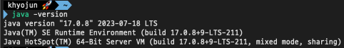
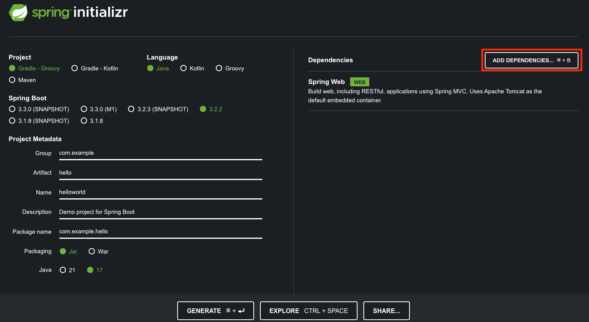
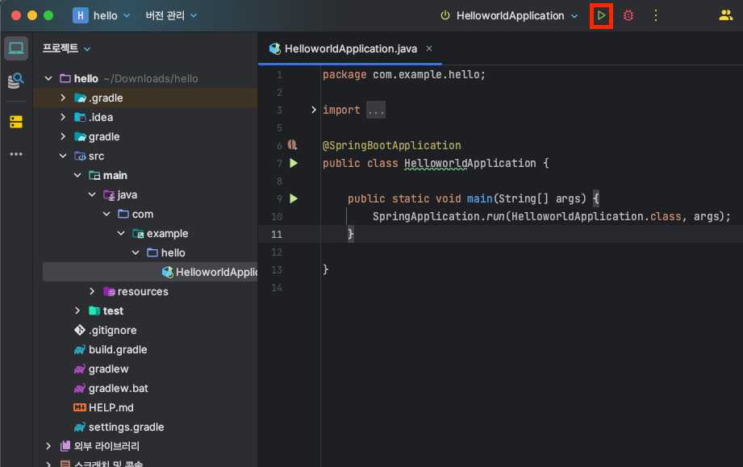
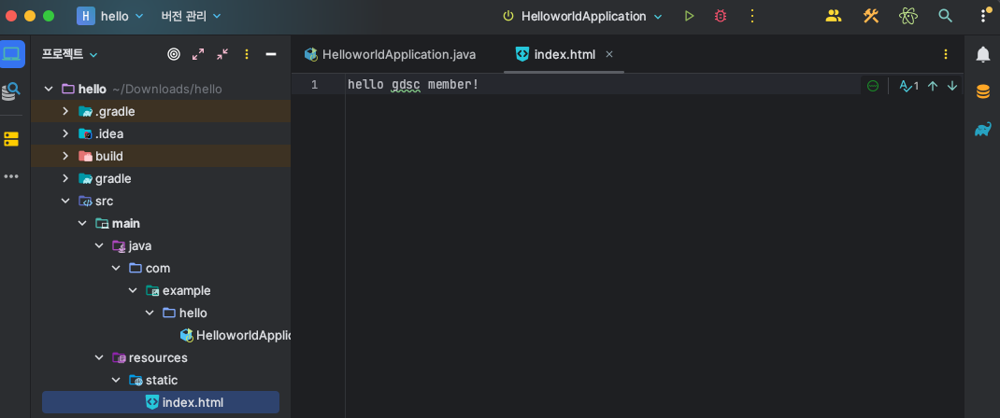

### GDSC BE Tutorial - Hands On

- 이용 대상
  - BE를 경험해보고 싶은 타 파트분들
- 제한 대상
  - gdsc BE 맴버

1장

- 0단계 : 시작하기 전 
  - start.spring.io 라는 곳이 있다. 스프링이 뭔지

- 1단계 : Download

  1. java download
     - 아래 링크로 들어가서 **java 17버전**으로 다운로드 받아주세요!
     - [설치 link](https://www.oracle.com/java/technologies/downloads)
     - 환경 변수 설정 방법 window : https://coding-factory.tistory.com/838
     - 환경 변수 설정 방법 mac : https://gymdev.tistory.com/72
     - 설치가 완료된 후 java -version을 cmd에 입력하면 아래와 같이 java 17버전이 깔렸다고 나와야 합니다．
     - 

  2. intellij 다운로드
     - 아래 링크로 들어가서 으로 다운로드 받아주세요!
     -[설치 link]() 

  - 2단계 : 실행 

    1. spring project download 
       - [spring.io](https://start.spring.io/)에서 들어가서 아래와 같이 설정해주세요.
       - 
       - 해당 화면과 같이 설정을 해주세요! 
         - 옆에 보이는 Spring Web은 Add Dependencies를 누르고 검색한 이후 선택하면 됩니다.
       - 이후 Generate를 눌러주세요!
    2. 스프링 첫 실행해보기
        - 
        - 재생 버튼 눌러보기!
        - http://localhost:8080/ 해당 url로 가보기
    3. resources/static/index.html
       - 해당 경로에 아래 사진과 같이 넣기!
       - 
       - 다시 http://localhost:8080/ 해당 url로 가보기
       - 어떻게 바뀌었나요?

🔎　생각해보기
>1. java 11 왜 선택할 수 없었을까요?
> 2. 어떻게 아무것도 안했는데 index.html이 보일까요?
> 3. http://localhost:8080/　에서　`:8080` 말고 다른 숫자로 바꿀 수 있는 방법이 있을까요?，　이 숫자가 어떤 의미였을까요?

위의 내용에 대한 답변은 pr로 남겨주세요

1장을 해보고 해당 이유에 대해서 알게 된 정보를 pr로 올려주세요.

정말 수고하셨습니다! 

