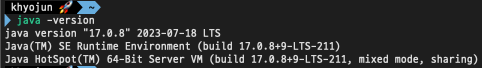
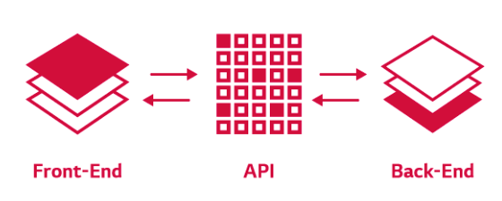
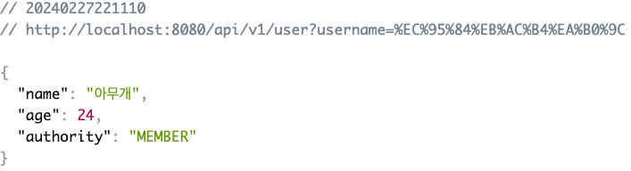
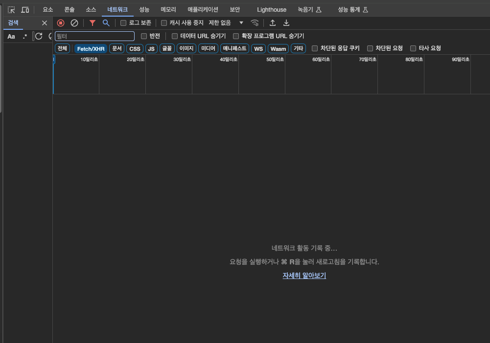
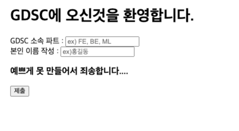
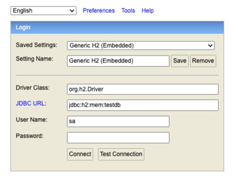
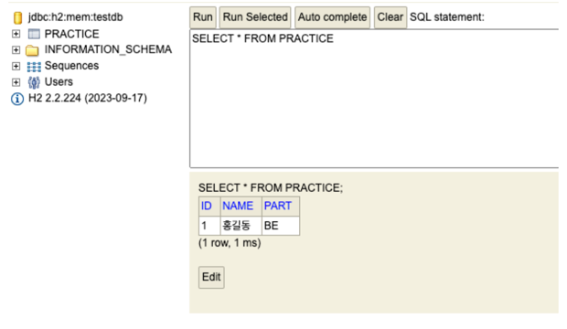

### GDSC BE Tutorial - Hands On

- 이용 대상
  - BE를 경험해보고 싶은 타 파트분들
- 제한 대상
  - gdsc BE 맴버

<details>
<summary>1장</summary>
<div markdown="1">

- 0단계 : 시작하기 전 
  - start.spring.io 라는 곳이 있다. 스프링이 뭔지

- 1단계 : Download

  1. java download
     - 아래 링크로 들어가서 **java 17버전**으로 다운로드 받아주세요!
     - [설치 link](https://www.oracle.com/java/technologies/downloads)
     - 환경 변수 설정 방법 window : https://coding-factory.tistory.com/838
     - 환경 변수 설정 방법 mac : https://gymdev.tistory.com/72
     - 설치가 완료된 후 java -version을 cmd에 입력하면 아래와 같이 java 17버전이 깔렸다고 나와야 합니다．
     - 

  2. intellij 다운로드
     - 아래 링크로 들어가서 으로 다운로드 받아주세요!
     -[설치 link]() 

- 2단계 : 실행 

  1. spring project download 
     - [spring.io](https://start.spring.io/)에서 들어가서 아래와 같이 설정해주세요.
     - 
     - 해당 화면과 같이 설정을 해주세요! 
       - 옆에 보이는 Spring Web은 Add Dependencies를 누르고 검색한 이후 선택하면 됩니다.
     - 이후 Generate를 눌러주세요!
  2. 스프링 첫 실행해보기
      - 
      - 재생 버튼 눌러보기!
      - http://localhost:8080/ 해당 url로 가보기
  3. resources/static/index.html
     - 해당 경로에 아래 사진과 같이 넣기!
     - 
     - 다시 http://localhost:8080/ 해당 url로 가보기
     - 어떻게 바뀌었나요?

### 🔎　생각해보기
> 1. java 11 왜 선택할 수 없었을까요?
> 2. 어떻게 아무것도 안했는데 index.html이 보일까요?
> 3. http://localhost:8080/　에서　`:8080` 말고 다른 숫자로 바꿀 수 있는 방법이 있을까요?，　이 숫자가 어떤 의미였을까요?

위의 내용에 대한 답변은 issue로 남겨주세요　


1장을 해보고 해당 이유에 대해서 알게 된 정보를 issue로 올려주세요.

정말 수고하셨습니다! 


</div>
</details>

<details>
<summary>2장</summary>
<div markdown="1">

- 1단계 : 백엔드가 하는 일 
  - 백엔드가 하는 일을 무엇이라고 생각하시나요?
    - 백엔드 개발자의 주된 업무는 서버 측 애플리케이션을 개발하는 일입니다.
    - 개발 중 사용자가 필요로 하는 정보를 저장하고 관리하며 전달하는 역할을 수행한다고 생각하시면 됩니다. 
    - 즉, 서버, 데이터베이스, API 관련 일을 합니다.
    - 이번 챕터에서는 API에 대해 간단하게 알아보는 시간을 가져 보도록 하겠습니다.

  - API 란? 
    - API는 클라이언트의 요청을 서버에 전달하고, 서버의 결과물을 클라이언트에게 잘 돌려주는 역할을 합니다. 
    - 간단하게 서버와 클라이언트의 '중개자'라고 말할 수 있습니다.
    - 


- 2단계 : 실습
  - 1장에서 다운로드 받은 스프링 프로젝트로 시작해 주세요.

### 📁 src/main/java/com/example/hello/

### HelloWorldApplication

```java
@SpringBootApplication
public class HelloworldApplication {

    public static void main(String[] args) {
        SpringApplication.run(HelloworldApplication.class, args);
    }

}
```


### 📁 src/main/java/com/example/hello/controller/

### GdscController

```java
@RestController
@RequestMapping("/api/v1")
public class GdscController {

    private final GdscService gdscService;

    public GdscController(GdscService gdscService) {
        this.gdscService = gdscService;
    }

    @GetMapping("/user")
    public ApiResponse callResponse(@RequestParam String username){
        return gdscService.madeMemberResponse(username);
    }

}
```

### 📁 src/main/java/com/example/hello/service/

### GdscService

```java
@Service
public class GdscService {
    public ApiResponse madeMemberResponse(String username) {
        return new ApiResponse(username, 본인나이를 넣어주세요, AUTHORITY.MEMBER);
    }
}
```


### 📁 src/main/java/com/example/hello/domain/

### Authority
```java
public enum Authority {
    MEMBER, CORE, LEAD;
}
```

### ApiResponse
```java
public record ApiResponse(String name, Integer age, AUTHORITY authority) {
}
```

- 3단계 : 결과화면
  - 1. 스프링 실행하고! 
  - 2. url 입력 : `localhost:8080/api/v1/user?username=아무개`
    - 

### 🔎　생각해보기
1. 실습에서 사용되었던 URL 을 보시게 되면 queryParameter가 사용되었는데요. queryParameter가 무엇일까요?
2. api 개발하기 전 api명세서를 작성하게 됩니다. api 명세서는 왜 필요할까요?
3. naver.com 에 들어갔을 때 어떤 api들이 요청되고 있을까요? (아래 사진과 같이 크롬의 개발자 탭 > 네트워크 탭 > Fetch/XHR 클릭하고 확인)


위의 내용에 대한 답변 및 질문은 issue로 남겨주세요.
1장을 해보고 해당 이유에 대해서 알게 된 정보를 issue로 올려주세요.

수고하셨습니다!
</div>
</details>

<details>
<summary>3장</summary>
<div markdown="1">

- 1단계 : 데이터베이스 & Spring Data JPA
  - Spring에서 데이터베이스를 사용하는 이유는 무었일까요?
    - 역할은 크게 5가지로 볼 수 있습니다. 데이터 저장, 데이터 검색 및 조회, 데이터 수정 및 삭제, 데이터 관리, 트랜잭션 관리 가 있습니다.
    - 이처럼 웹에서 주고받는 데이터 관련 작업을 위해서는 데이터베이스가 필요하게 됩니다.
    - 특히 Spring에서는 다양한 기능을 통해 개발자가 쉽게 데이터베이스와 상호작용하고 데이터를 관리할 수 있도록 지원합니다. 
  - Spring Data JPA를 아시나요?
    - Spring 프레임워크에서 제공하는 기능 중 하나로 JPA를 쉽게 사용할 수 있도록 합니다.
    - 이때, JPA(Java Persistence API)는 자바에서 객체를 관계형 데이터베이스에 매핑하기 위해 표준 인터페이스를 제공하는 기능을 합니다. 

- 2단계 : 실습 개요
  - 이번 예제에서는 h2데이터베이스를 사용하여 데이터베이스를 간단하게 다뤄보겠습니다. 
  - 로컬환경에서 실행할 때 내장된 H2데이터베이스를 사용하여 DB에 데이터를 저장하고 테스트할 수 있습니다. 
  - **이번 실습에서는 이전 장과 다르게 코드를 작성하는데 있어서 자세하게 설명해 드리지 않습니다. 여러분들이 작성해 보면서 생각해보시길 바랍니다.**

- 3단계 : database 연결 및 실습
  - build.gradle 파일에 의존성 추가
    ```
    implementation 'org.springframework.boot:spring-boot-starter-thymeleaf'
    implementation 'org.springframework.boot:spring-boot-starter-data-jpa'
    runtimeOnly 'com.h2database:h2'
    compileOnly 'org.projectlombok:lombok'
    ```
  - application.properties 파일에 의존성 추가
    ```properties
    spring.datasource.url=jdbc:h2:mem:testdb
    spring.datasource.username=sa
    spring.datasource.password=
    
    spring.jpa.hibernate.ddl-auto=create-drop
    spring.jpa.show-sql=true
    spring.jpa.properties.hibernate.dialect=org.hibernate.dialect.H2Dialect
      ``` 
### 📁 resources/templates/index.html
```html
<!doctype html>
<html lang="ko">
<head>
 <meta charset="UTF-8">
 <meta name="viewport"
       content="width=device-width, user-scalable=no, initial-scale=1.0, maximum-scale=1.0, minimum-scale=1.0">
 <meta http-equiv="X-UA-Compatible" content="ie=edge">
 <title>GDSC Information Form</title>
</head>
<body>


 <h1>GDSC에 오신것을 환영합니다.</h1>
 <form action="/submit" method="post">
   <div>
     <label for="gdscPart">GDSC 소속 파트 : </label><input type="text" id="gdscPart" name="part" placeholder="ex) FE, BE, ML">
   </div>
   <div>
     <label for="gdscCreate">본인 이름 작성 : </label><input type="text" id="gdscCreate" name="name" placeholder="ex)홍길동">
   </div>


   <div>
     <p>
       <h3> 예쁘게 못 만들어서 죄송합니다.... </h3>
     </p>
   </div>
   <button type="submit">제출</button>
 </form>
</body>
</html>

```
### 📁 controller/homeController
```java
@Controller
public class HomeController {
   @GetMapping("/")
   public String home(){
       return "index";
   }
}
```
### 📁 controller/DbController
```java
@RestController
@RequiredArgsConstructor
public class DbController {
   private final DbService dbService;
   @PostMapping("/submit")
   public String submit(@ModelAttribute PracticeDto practiceDto){
       dbService.save(practiceDto);
       return "<h2>작성하신 내용이 db에 저장되었습니다. h2 DB를 확인해주세요!</h2>";
   }
}
```
### 📁 domain/Practice
```java
@Entity
@Getter
public class Practice {

   @Id
   @GeneratedValue(strategy = GenerationType.AUTO)
   private Long id;

   public Practice() {
   }

   private String part;
   private String name;

   @Builder
   public Practice(String part, String name) {
       this.part = part;
       this.name = name;
   }
}
```
### 📁 dto/PracticeDto
```java
public record PracticeDto(String part, String name) {
   public Practice toEntity(){
       return Practice.builder()
           .part(part)
           .name(name)
           .build();
   }
}
```
### 📁 repository/PracticeRepository
```java
public interface PracticeRepository extends JpaRepository<Practice, Long> {
}

```
### 📁 service/DbService
```java
@Service
@RequiredArgsConstructor
public class DbService {


   private final PracticeRepository practiceRepository;


   public void save(PracticeDto practiceDto){
       Practice entity = practiceDto.toEntity();
       practiceRepository.save(entity);


   }
}

```
# 결과화면 
## localhost:8080/ 접속시
  
## 작성 후 제출 누를 시
  
## localhost:8080/h2-console 접속시(바로 connect 눌러주세요)
  
## db 조회시(이전에 작성한 대로 들어가야합니다!)
  

### 🔎　생각해보기
1. 위의 실습에서 어떤 과정을 거쳐 '결과 화면'이 뜨게 된걸까요?
    순서대로 작성해볼까요? 
2. MySQL을 들어보셨을텐데요. 이번에 사용한 h2 database는 뭘까요? 
3. (선택) form 으로 제출한 후 어떻게 컨트롤러 파라미터에 바인딩이 됐을까요?
   <br>*힌트 : requestParam이랑 modelAttribute의 차이점은 무었일까요?
4. 지금까지 코드를 작성을 하면서 발생했던 문제점이 있었다면 작성해 봐주세요.

위의 내용에 대한 답변은 issue로 남겨주세요　
1장을 해보고 해당 이유에 대해서 알게 된 정보를 issue로 올려주세요.

정말 수고하셨습니다!
</div>
</details>