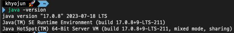
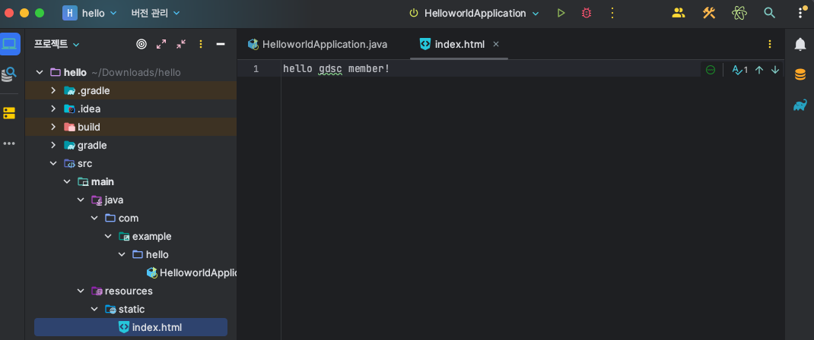

# 1장

## 1. Download

### java download

- 아래 링크로 들어가서 **java 17버전**으로 다운로드 받아주세요!
- [설치 link](https://www.oracle.com/java/technologies/downloads)
- 환경 변수 설정 방법 window : https://coding-factory.tistory.com/838
- 환경 변수 설정 방법 mac : https://gymdev.tistory.com/72
- 설치가 완료된 후 java -version을 cmd에 입력하면 아래와 같이 java 17버전이 깔렸다고 나와야 합니다．

  

### intellij 다운로드

설치 링크로 들어가서 다운로드 받아주세요!  
무료버전인 Community 버전을 다운 받아 주셔야합니다!

[intellij IDEA]("https://www.jetbrains.com/ko-kr/idea/download/?section=windows")

### 실행

**1. spring project download**

- [spring.io](https://start.spring.io/)에 들어가서 아래와 같이 설정해주세요.
  
- 해당 화면과 같이 설정을 해주세요!
- 스프링부트의 버전은 ‘괄호’가 있지 않은 가장 최신의 버전을 선택해 주시면 됩니다. 
- 옆에 보이는 Spring Web은 Add Dependencies를 누르고 검색한 이후 선택하면 됩니다.
- 이후 Generate를 눌러주세요!

**2. 스프링 첫 실행해보기**

- 다운 받은 zip 파일을 압축을 풀고 그 파일을 intelliJ에서 열어주시면 됩니다. 
 
- 재생 버튼 눌러보기!
- http://localhost:8080/ 해당 url로 가보기

3. resources/static/index.html
   - 해당 경로에 아래 사진과 같이 넣기!

   - 다시 http://localhost:8080/ 해당 url로 가보기
   - 어떻게 바뀌었나요?

### 🔎 　생각해보기

> 1. java 11 왜 선택할 수 없었을까요?
> 2. 어떻게 아무것도 안했는데 index.html이 보일까요?
> 3. http://localhost:8080/에서　`:8080` 말고 다른 숫자로 바꿀 수 있는 방법이 있을까요?，　이 숫자가 어떤 의미였을까요?

위의 내용에 대한 답변은 `issue`로 남겨주세요
또, 1장을 해보고 해당 이유에 대해서 알게 된 정보를 `issue`로 올려주세요.

정말 수고하셨습니다!
