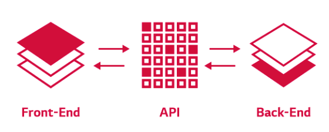
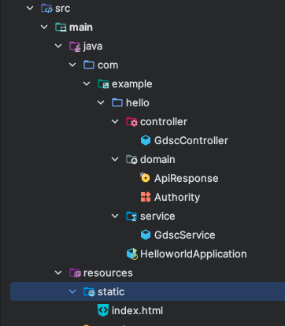
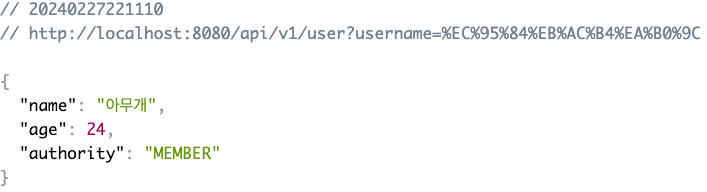
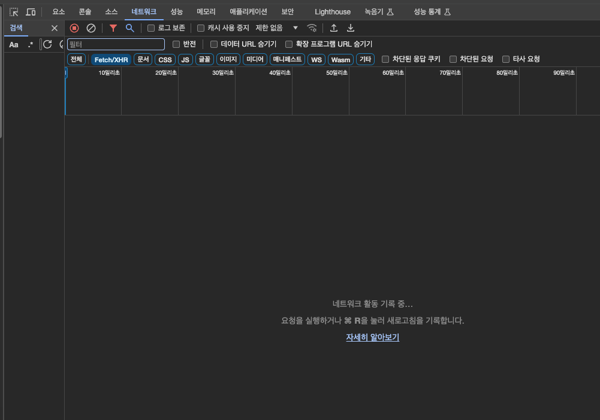

# 2장

### 1단계 : 백엔드가 하는 일

**백엔드가 하는 일을 무엇이라고 생각하시나요?**

- 백엔드 개발자의 주된 업무는 서버 측 애플리케이션을 개발하는 일입니다.
- 개발 중 사용자가 필요로 하는 정보를 저장하고 관리하며 전달하는 역할을 수행한다고 생각하시면 됩니다.
- 즉, 서버, 데이터베이스, API 관련 일을 합니다.
- 이번 챕터에서는 API에 대해 간단하게 알아보는 시간을 가져 보도록 하겠습니다.

**API 란?**

- API는 클라이언트의 요청을 서버에 전달하고, 서버의 결과물을 클라이언트에게 잘 돌려주는 역할을 합니다.
- 간단하게 서버와 클라이언트의 **중개자**라고 말할 수 있습니다.
- 

### 2단계 : 실습

> [1장](page1.md) 에서 다운로드 받은 스프링 프로젝트로 시작해 주세요.<br>
> 아래의 코드를 모두 작성하셔야 빨간줄(에러)가 발생하지 않습니다.

### 📁 src/main/java/com/example/hello/

### HelloWorldApplication

```java
@SpringBootApplication
public class HelloworldApplication {

    public static void main(String[] args) {
        SpringApplication.run(HelloworldApplication.class, args);
    }

}
```

### 📁 src/main/java/com/example/hello/controller/

### GdscController

```java
@RestController
@RequestMapping("/api/v1")
public class GdscController {

    private final GdscService gdscService;

    public GdscController(GdscService gdscService) {
        this.gdscService = gdscService;
    }

    @GetMapping("/user")
    public ApiResponse callResponse(@RequestParam String username){
        return gdscService.madeMemberResponse(username);
    }

}
```

### 📁 src/main/java/com/example/hello/service/

### GdscService

```java
@Service
public class GdscService {
    public ApiResponse madeMemberResponse(String username) {
        return new ApiResponse(username, 본인나이를 넣어주세요, AUTHORITY.MEMBER);
    }
}
```

### 📁 src/main/java/com/example/hello/domain/

### Authority

```java
public enum Authority {
    MEMBER, CORE, LEAD;
}
```

### ApiResponse

```java
public record ApiResponse(String name, Integer age, Authority authority) {
}
```
+ 최종적인 파일 구조는 다음과 같습니다.
  
   

### 3단계 : 결과화면

1. 스프링 실행하고!
2. url 입력 : `localhost:8080/api/v1/user?username=아무개`

   

### 🔎 　생각해보기

> 1. 실습에서 사용되었던 URL 을 보시게 되면 `queryParameter`가 사용되었는데요.  
>    `queryParameter`가 무엇일까요?
> 2. api 개발하기 전 api명세서를 작성하게 됩니다. api 명세서는 왜 필요할까요?
> 3. naver.com 에 들어갔을 때 어떤 api들이 요청되고 있을까요?  
>    (아래 사진과 같이 크롬의 > 개발자 탭 > 네트워크 탭 > Fetch/XHR 클릭하고 확인)
>    

위의 내용에 대한 답변 및 질문은 `issue`로 남겨주세요.  
2장을 해보고 해당 이유에 대해서 알게 된 정보를 `issue`로 올려주세요.
형식은 자유입니다!

수고하셨습니다!
