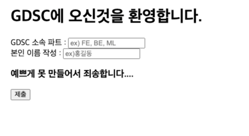
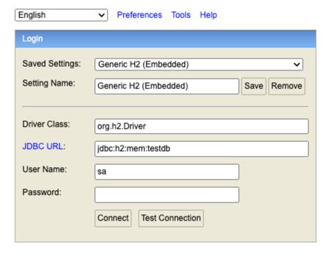
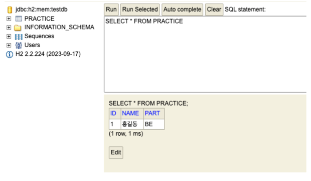

# 3장

### 1단계 : 데이터베이스 & Spring Data JPA

**Spring에서 데이터베이스를 사용하는 이유는 무엇일까요?**

- 역할은 크게 5가지로 볼 수 있습니다. 데이터 저장, 데이터 검색 및 조회, 데이터 수정 및 삭제, 데이터 관리, 트랜잭션 관리가 있습니다.
- 이처럼 웹에서 주고받는 데이터 관련 작업을 위해서는 데이터베이스가 필요하게 됩니다.
- 특히 Spring에서는 다양한 기능을 통해 개발자가 쉽게 데이터베이스와 상호작용하고 데이터를 관리할 수 있도록 지원합니다.
- **Spring Data JPA를 아시나요?**

      - Spring 프레임워크에서 제공하는 기능 중 하나로 JPA를 쉽게 사용할 수 있도록 합니다.
      - JPA(Java Persistence API)는 자바에서 객체를 관계형 데이터베이스에 매핑하기 위해 표준 인터페이스를 제공하는 기능을 합니다.

## 2단계 : 실습 개요

- 이번 예제에서는 H2 데이터베이스를 사용하여 데이터베이스를 간단하게 다뤄보겠습니다.
- 로컬환경에서 실행할 때 내장된 H2데이터베이스를 사용하여 DB에 데이터를 저장하고 테스트할 수 있습니다.
- **이번 실습에서는 이전 장과 다르게 코드를 작성하는데 있어서 자세하게 설명해 드리지 않습니다. 여러분들이 작성해 보면서 생각해보시길 바랍니다.**

## 3단계 : database 연결 및 실습

- build.gradle 파일에 의존성 추가
  ```
  implementation 'org.springframework.boot:spring-boot-starter-thymeleaf'
  implementation 'org.springframework.boot:spring-boot-starter-data-jpa'
  runtimeOnly 'com.h2database:h2'
  compileOnly 'org.projectlombok:lombok'
  ```
- application.properties 파일에 의존성 추가

  ```properties
  spring.datasource.url=jdbc:h2:mem:testdb
  spring.datasource.username=sa
  spring.datasource.password=

  spring.jpa.hibernate.ddl-auto=create-drop
  spring.jpa.show-sql=true
  spring.jpa.properties.hibernate.dialect=org.hibernate.dialect.H2Dialect
  ```

### 📁 resources/templates/index.html

```html
<!doctype html>
<html lang="ko">
<head>
 <meta charset="UTF-8">
 <meta name="viewport"
       content="width=device-width, user-scalable=no, initial-scale=1.0, maximum-scale=1.0, minimum-scale=1.0">
 <meta http-equiv="X-UA-Compatible" content="ie=edge">
 <title>GDSC Information Form</title>
</head>
<body>


 <h1>GDSC에 오신것을 환영합니다.</h1>
 <form action="/submit" method="post">
   <div>
     <label for="gdscPart">GDSC 소속 파트 : </label><input type="text" id="gdscPart" name="part" placeholder="ex) FE, BE, ML">
   </div>
   <div>
     <label for="gdscCreate">본인 이름 작성 : </label><input type="text" id="gdscCreate" name="name" placeholder="ex)홍길동">
   </div>


   <div>
     <p>
       <h3> 예쁘게 못 만들어서 죄송합니다.... </h3>
     </p>
   </div>
   <button type="submit">제출</button>
 </form>
</body>
</html>

```

### 📁 controller/homeController

```java
@Controller
public class HomeController {
   @GetMapping("/")
   public String home(){
       return "index";
   }
}
```

### 📁 controller/DbController

```java
@RestController
@RequiredArgsConstructor
public class DbController {
   private final DbService dbService;
   @PostMapping("/submit")
   public String submit(@ModelAttribute PracticeDto practiceDto){
       dbService.save(practiceDto);
       return "<h2>작성하신 내용이 db에 저장되었습니다. h2 DB를 확인해주세요!</h2>";
   }
}
```

### 📁 domain/Practice

```java
@Entity
@Getter
public class Practice {

   @Id
   @GeneratedValue(strategy = GenerationType.AUTO)
   private Long id;

   public Practice() {
   }

   private String part;
   private String name;

   @Builder
   public Practice(String part, String name) {
       this.part = part;
       this.name = name;
   }
}
```

### 📁 dto/PracticeDto

```java
public record PracticeDto(String part, String name) {
   public Practice toEntity(){
       return Practice.builder()
           .part(part)
           .name(name)
           .build();
   }
}
```

### 📁 repository/PracticeRepository

```java
public interface PracticeRepository extends JpaRepository<Practice, Long> {
}

```

### 📁 service/DbService

```java
@Service
@RequiredArgsConstructor
public class DbService {


   private final PracticeRepository practiceRepository;


   public void save(PracticeDto practiceDto){
       Practice entity = practiceDto.toEntity();
       practiceRepository.save(entity);


   }
}

```

## 결과화면

### localhost:8080/ 접속시,

## 

### 작성 후 제출 누를 시,

## 

### localhost:8080/h2-console 접속시(바로 connect 눌러주세요)

## 

### db 조회시(이전에 작성한 대로 들어가야합니다!)

## 

## 🔎 　생각해보기

````
1. 위의 실습에서 어떤 과정을 거쳐 '결과 화면'이 뜨게 된걸까요?
   순서대로 작성해볼까요?
2. MySQL을 들어보셨을텐데요. 이번에 사용한 h2 database는 뭘까요?
3. (선택) form 으로 제출한 후 어떻게 컨트롤러 파라미터에 바인딩이 됐을까요?
    힌트 : requestParam이랑 modelAttribute의 차이점은 무엇일까요?
4. 지금까지 코드를 작성을 하면서 발생했던 문제점이 있었다면 작성해 봐주세요.
````

위의 내용에 대한 답변은 `issue`로 남겨주세요
3장을 해보고 해당 이유에 대해서 알게 된 정보를 `issue`로 올려주세요.

정말 수고하셨습니다!
